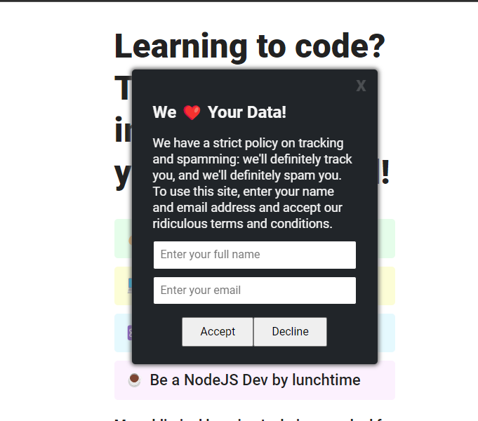
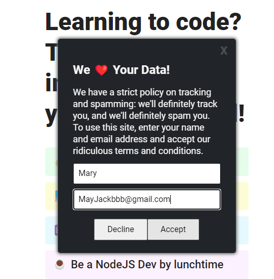
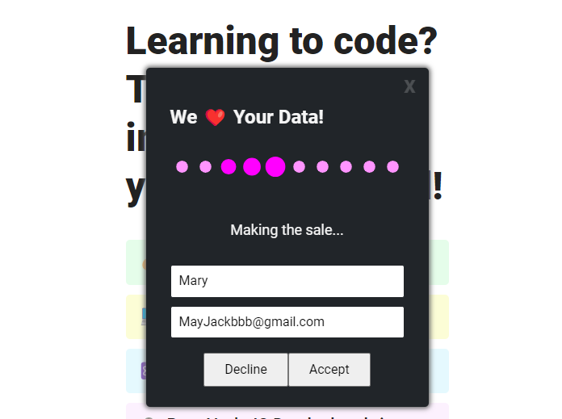
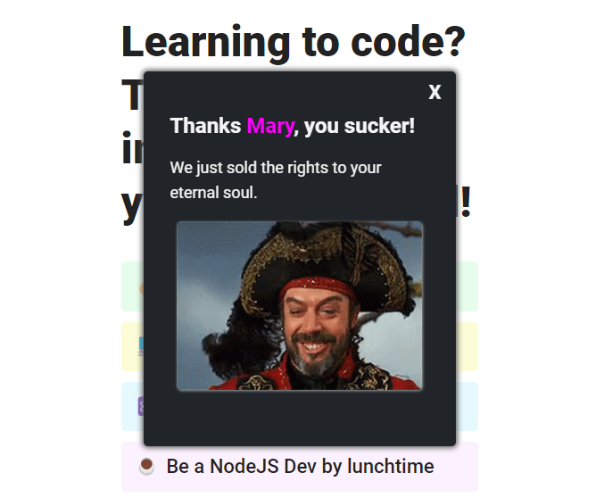

# Cookies Project

https://cookies-site-project.netlify.app/

Quick start:

```
$ npm install
$ npm start
```

Head over to https://vitejs.dev/ to learn more about using vite

## Screenshots

### Before Entring Name and Email address 😒😯





### After Entring Name and Email address 😩😧






------


## Languages and Tools are used

1. **Languages**
    + [HTML](https://github.com/topics/html)
    + [HTML5](https://github.com/topics/html5)
    + [CSS](https://github.com/topics/css)
    + [CSS3](https://github.com/topics/css3)
    + [React](https://github.com/topics/react)
    + [JavaScript](https://github.com/topics/javascript)

2. **Tools** 
    + [Chrome](https://github.com/topics/chrome)
    + [VSCode](https://github.com/topics/vscode)
    + [Figma](https://github.com/topics/figma)
    + [Netlify](https://github.com/topics/netlify)


